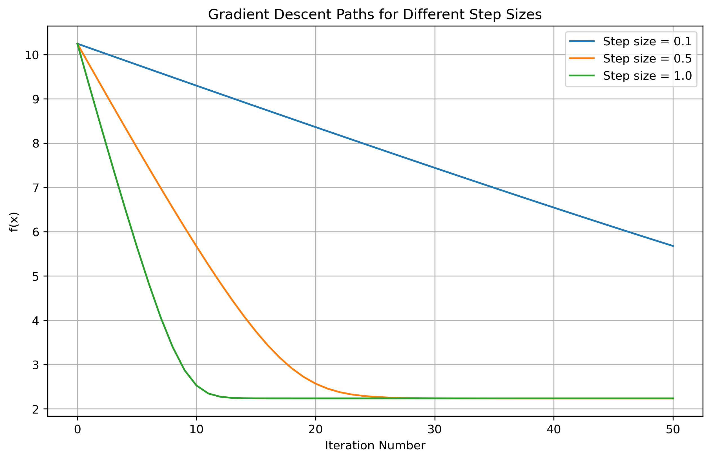
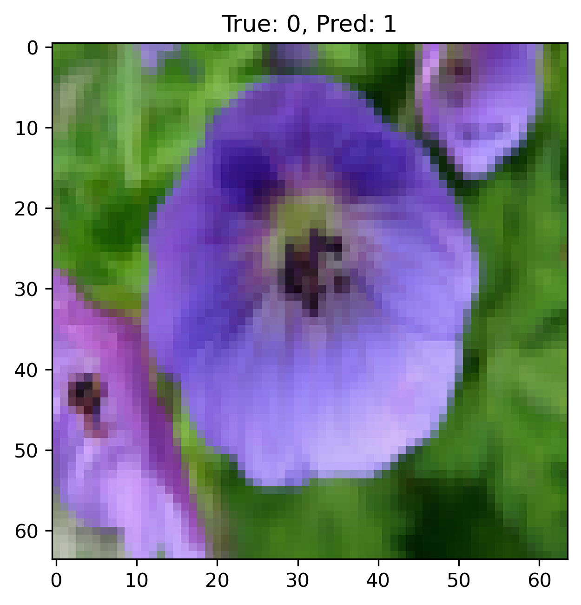

# Python Assignment 6

This repository contains the solution to AMS 595 - Assignment 6, which explores a variety of numerical methods and machine learning algorithms, including Gradient Descent, Linear Regression, Logistic Regression, and Image Classification.

<!-- ## Objectives

The assignment is structured to:

1. Enhance problem-solving skills using Python.
2. Implement and optimize machine learning algorithms.
3. Visualize results for better understanding and interpretation.
4. Familiarize with using Jupyter Notebooks for clear documentation and reproducibility.

## Project Tasks

### 1. Good Presentation of Code and Outputs (10 pts)
- Ensure well-commented code.
- Add titles, legends, and axis labels for plots.
- Divide code into logical blocks for better readability. -->

### Gradient Descent Implementation
- Function: `f(x) = sqrt{x^2 + 5}`
- Tasks:
  - Derive and plot the function.
  - Implement Gradient Descent with multiple step sizes.
  - Analyze and visualize convergence rates.
- **Output:**
  

### Linear Regression
- Generate synthetic 2D data.
- Perform linear regression using the normal equation.
- Plot data and the regression plane.
- **Output:**
  

### Logistic Regression
- Fine-tune learning rate and epochs.
- Add meaningful comments to the provided logistic regression code.
- **Output:**
  
  

### Image Binary Classification
- Implement a binary classification model.
- Analyze and display misclassified test cases.
- Re-train and evaluate the model using a modified dataset.
- **Misclassified images (Showing 4/20):**
  
  
  
  

## Performance Summary

### Gradient Descent
- Final `x_T` for various step sizes:
  - \(0.1\): 5.22
  - \(0.5\): 0.0007
  - \(1.0\): ~0

### Linear Regression
- Intercept: 3.80
- Coefficients: [4.11, 0.47]

### Logistic Regression
- Training Accuracy: 88%
- Test Accuracy: 100%

### Image Classification
#### Original Dataset
- Train Accuracy: 88.12%
- Test Accuracy: 59.18%
- Misclassified Images: 20
- Misclassified Indices: [ 2  3  4  7  9 10 11 15 17 19 23 25 28 32 35 36 37 40 42 44]

#### Modified Dataset
- Train Accuracy: 90.30%
- Test Accuracy: 56.82%
- Misclassified Images: 19
- Misclassified Indices: [ 2  4  5  6  8  9 10 12 14 18 20 23 27 30 31 32 35 37 39]